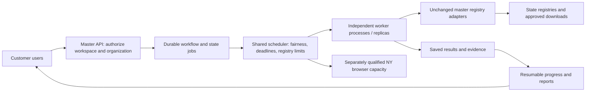

# Enterprise capacity: implementation and qualification plan

Scope: isolated CharityClarity performance lab only. No staging/production or
customer-browser changes. Current measured work uses the master 32-state code;
New York live browser collection remains outside the lab benchmark.

## What has actually changed

The single lab worker was upgraded from 1 CPU / 2 GB to 2 CPU / 4 GB. A controlled
same-code comparison retained four slots: the two-organization group improved
from 251.7 to 174.9 seconds, with all 62 backend-state results matching. Live
registry timing can vary, so this is useful measured evidence, not an isolated
CPU microbenchmark. The subsequent candidate doubles reservations to eight and
introduces organization-fair admission plus shared discovery/browser reservations.
Its live qualification is recorded separately in the experiment results.

No account, subscription, payment model, or shared-credential customer rollout
is being implemented as part of this capacity experiment.

## Architecture needed for hundreds of users

1. **Persist accepted work before acknowledging it.** Store an immutable
   workspace, EIN, entered legal name, reviewed aliases, mode, source version,
   identity evidence and deadline. Return a workflow ID promptly. Opening or
   closing a tab must not lose an accepted workflow. Idempotent submission
   prevents double-click/network retries from creating duplicate work.
2. **One shared scheduling authority.** Transactional claims/leases coordinate
   all API and worker replicas. Do not instantiate a separate “global” semaphore
   in every replica. Apply organization/workspace fairness and an explicit
   active-workflow ceiling, initially the previously agreed 15, with additional
   accepted workflows waiting visibly. Hundreds of users is a different measure
   from 100 simultaneous running 32-state checks.
3. **Workers with bounded processes.** A worker executes the same master lookup
   engine. It advertises measured free slots, not a guessed thread count. Track
   discovery, state work, PDF/OCR and evidence generation against actual shared
   CPU/memory capacity. Split resource classes only when physical accounting
   remains correct. Ensure admission cannot starve short direct/download tasks.
4. **Safe lifecycle.** Heartbeats, fencing tokens and conditional completion
   prevent lost workers from later overwriting a replacement result. Cancellation
   and deadlines propagate into process/network/browser cleanup. A timed-out
   task continues to occupy capacity until it has actually stopped. Registry
   checks are read-only, but duplicated in-flight attempts can still overload a
   registry; do not blindly requeue a live orphan on an expired lease.
5. **Registry-wide limits.** Maine/Arkansas locks, Florida lane limits and
   browser verification exist independently of total server CPU. Current limits
   are in-process; replicas must coordinate upstream pacing rather than multiply
   it silently. More compute cannot promise unlimited state-site throughput.
6. **Progress and results independent of long HTTP calls.** Polling/SSE reads
   saved progress, so a large queue does not consume thousands of open lookup
   connections. Report queue time separately from execution and discovery.
   Queue capacity or deadline failures must never become Not Registered.
7. **Workspace isolation and reuse.** The master derives workspace permissions
   from individual authenticated sessions. Deduplicate identical active work
   only within its authorized scope, including reviewed names and mode/version.
   Public-state caches need explicit freshness and provenance. This is not
   authorization to silently reuse another customer's private result.
8. **New York as its own qualification track.** The current customer connector
   depends on a browser profile/session. Neither server replicas nor this
   backend-only benchmark certify its capacity. Establish a supported isolated
   browser/connector topology, verification lifecycle, and multi-user tests
   before promising all 32 states at enterprise concurrency.

## Capacity experiments and stopping rules

Start with the exact same controls on a settled build; use identical discovered
name sets and retain first responses, including failures. Compare status, EIN,
matched record/name, and date fields, not status alone. Add diverse controls
after a configuration clears its baseline. Raise load 1, 2, 3, 5, 10, 15 only
while results remain consistent and mean per-organization latency has not risen
50% above its same-build single-org controls. A stop means diagnose and change
the constrained configuration before increasing load; it is not a claim that
every latency increase is a software defect.

Then validate 15 separate users, mixed discovery/registration, cold and warm
caches, Sales and Standard, long-lived batches, a 16th queued workflow, worker
loss, restart recovery, duplicate submission, cancellation and tenant isolation.
The current 100-organization/3,200-job local fixture proves only scheduler
invariants and cleanup; it does not emulate registry timings or failures.

For hundreds of simultaneous submissions, test the acceptance/progress layer
and durable backlog first with fixtures. Increase *live* registry traffic only
within verified registry-specific limits. Maintain warm spare workers for burst
load; autoscaling after the burst is not an immediate capacity guarantee.

## What to size from measurements

Use total worker-seconds per organization and target arrival/completion rates,
plus CPU/memory per busy worker and slowest-registry throughput. Derive the
required worker count from the measured demand with headroom, then validate it.
Do not multiply one successful example by 100 and present that as certification.
Sales keeps its 60-second total deadline; queue waiting counts toward that
customer experience. Standard preserves complete conservative state checks.

## Release gate

No enterprise readiness claim until shared durable coordination, independent NY
coverage, workspace isolation, failure recovery, and representative repeated
15-user controls pass. Larger target loads require their own measured evidence.
All work remains in the lab until the user reviews the results and explicitly
authorizes promotion.
